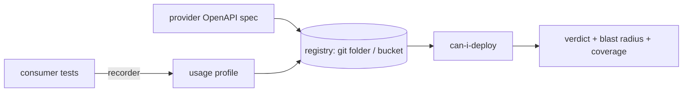

# usagecontract

[](https://www.npmjs.com/package/usagecontract)
[](https://github.com/javvadivijayprasad/usagecontract/actions)
[](LICENSE)
[](package.json)

**Catch the API changes that actually break your consumers — without writing a single contract.**

usagecontract watches your existing tests, learns which response fields each consumer *actually
reads*, and fails CI only when a provider spec change breaks a consumer that truly depends on the
changed field. You get Pact-style "who breaks?" precision with the cost of a linter: no DSL, no
duplicate contract file, no broker.

> `1.0.0`. Node ≥ 18. HTTP clients: global `fetch` and `axios` (`got`/`undici` on the roadmap).
> **New here?** Read **[GETTING-STARTED.md](GETTING-STARTED.md)** for the full walkthrough.

---

## Why

A schema (OpenAPI) says what an API response *may* contain. It does **not** say what any consumer
*depends on*. So the two common tools each fall short:

| | Pact | openapi-diff (schema-diff) | **usagecontract** |
|---|---|---|---|
| Knows which consumer breaks | yes (hand-written) | no | **yes (auto)** |
| Contract authoring | DSL, per field | none | **none (recorded)** |
| False alarms on unused fields | no | **many** | **none** |
| Extra service to run | broker + DB | none | **none** |
| Single source of truth | no (spec + pact JSON) | yes | **yes** |

On real OpenAPI specs, schema-diff tools are right only ~17–22% of the times they raise an alarm
(the rest are changes no consumer uses). usagecontract reaches ~100% precision by conditioning on
real usage. See the [paper](#citation).

---

## How it works



1. **Record.** Your normal tests run through a recorder that observes which fields each consumer
   reads. That produces a `*.profile.json` — the *derived contract*. Nobody authors it.
2. **Gate.** When the provider proposes a new spec, `can-i-deploy` compares it against every
   recorded profile and reports exactly which consumers (if any) break.

A change is **breaking for a consumer** iff its recorded profile was satisfiable under the old spec
but not the new one: a field/operation it reads is removed or renamed, a type becomes incompatible,
a read field becomes optional, or a request parameter becomes newly-required.

---

## Install

```bash
npm install --save-dev usagecontract
```

---

## Usage

### 1. Record a consumer's usage (in its tests)

**fetch:**

```js
const { record } = require('usagecontract');
const spec = require('./specs/orders.openapi.json');

beforeAll(() => { record.install(spec); record.start({ provider: 'orders', specRef: 'orders@1.0.0' }); });
afterAll(() => record.flush('web-app', { dir: './profiles' }));

// your existing tests that call the API run unchanged
```

**axios** (attach the adapter to your instance):

```js
const { record } = require('usagecontract');
const axios = require('axios');
const spec = require('./specs/orders.openapi.json');

const api = axios.create({ baseURL: process.env.API_URL });
beforeAll(() => { record.installAxios(api, spec); record.start({ provider: 'orders', specRef: 'orders@1.0.0' }); });
afterAll(() => record.flush('web-app', { dir: './profiles' }));
```

Works with any runner (Jest, Vitest, `node --test`, Mocha). Run your tests, then commit the
generated `profiles/web-app.profile.json`.

### 2. Gate provider changes (CLI)

```bash
npx usagecontract can-i-deploy \
  --base ./specs/orders.openapi.json \
  --candidate ./specs/orders.openapi.next.json \
  --profiles ./profiles \
  --min-coverage 70
```

```
BREAKING: 1 of 3 consumer(s) affected:
  - web-app: total (field-removed-or-renamed)
  safe: batch-reconciler, mobile-lite
coverage (verdict confidence - how much each consumer exercised the API):
  ! coverage web-app  43% (3/7 fields)  unread: currency, id, items[].qty, ...
```

Exit code `0` = safe, `1` = breaking (or below coverage floor), `2` = bad input.

### 3. GitHub Action

```yaml
- uses: javvadivijayprasad/usagecontract@v1.0.0
  with:
    base: ./specs/orders.openapi.json
    candidate: ./specs/orders.openapi.next.json
    profiles: ./profiles
```

---

## CLI reference

```
usagecontract can-i-deploy --base <spec> --candidate <spec> --profiles <dir> [--min-coverage <0-100>]
    Fail if the candidate spec breaks any recorded consumer. Prints blast radius + coverage.

usagecontract coverage --spec <spec> --profiles <dir> [--min-coverage <0-100>]
    Report how much of each operation each consumer exercised. Fail below the threshold.

usagecontract verify --spec <spec> --profiles <dir>
    Check every recorded profile is satisfied by the spec.
```

## Programmatic API

```js
const { record, compat, isBreaking, coverage } = require('usagecontract');

record.install(spec);                  // patch fetch
record.installAxios(axiosInstance, spec); // or attach to axios
record.start({ provider, specRef });   // begin a recording
const profile = record.stop('web-app'); // -> profile object
record.flush('web-app', { dir });      // stop + write to a folder

compat(spec, profile);                 // { compatible, violations }
isBreaking(beforeSpec, afterSpec, profile); // { breaking, violations }
coverage(spec, profile);               // { pct, read, reachable, perOp }
```

## Where does this run?

- **Consumer-side:** consumers record profiles; the provider's release pipeline pulls the shared
  profiles and runs `can-i-deploy` before shipping a spec change.
- **Monorepo:** one CI job records all profiles, then gates.

The "registry" is just a folder of JSON files (commit them, or sync to an S3/GCS bucket).

## OpenAPI support

`$ref`, `allOf` (inheritance), `oneOf`/`anyOf` (polymorphism), nested objects, arrays of objects
and scalars. OpenAPI 3.0 and 3.1.

## Limitations

- A profile reflects only **exercised** paths; untested consumer code is invisible. Pair with
  coverage reporting (built in) and merge profiles across runs / production traffic.
- **Enum exhaustiveness** (a consumer that switches on every enum value) can't be observed from
  traffic — annotate such dependencies if needed.
- HTTP clients: `fetch` and `axios` today.

## Development

```bash
npm test              # run the test suite (node --test)
npm run test:coverage # enforce coverage floor (90% lines / 75% branches / 90% funcs)
npm run example       # end-to-end demo
```

## Citation

If you use usagecontract, please cite it (see [CITATION.cff](CITATION.cff)):

```
Prasad, V. (2026). usagecontract: usage-aware, spec-anchored contract testing (v1.0.0) [Software].
```

Underlying method: *"Usage-Aware, Spec-Anchored Contract Testing: Deriving Consumer Contracts from
Observed Traffic"* (preprint / under submission).

## Contributing

See [CONTRIBUTING.md](CONTRIBUTING.md). Issues and PRs welcome.

## License

MIT — see [LICENSE](LICENSE).
